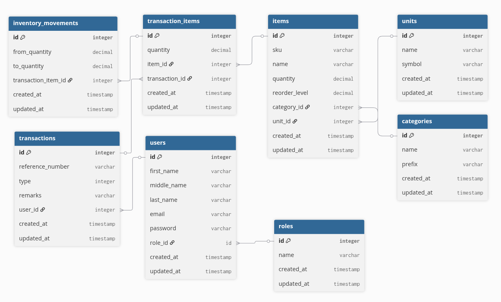

# Inventory Management

Monorepo for an inventory management system: a **Laravel 12** JSON API with **Laravel Sanctum** (SPA / cookie authentication) and a **React + Vite** single-page application. Warehouse staff manage items and stock transactions; administrators manage users, categories, and units.

---

## System architecture

The **browser** loads the Vite-built React SPA, which talks to the **Laravel REST API** over HTTP (JSON, cookies, and Sanctum’s CSRF flow). The API persists data in **MySQL**.

### Frontend (`apps/web`)

React 19, React Router, TanStack Query & Table, React Hook Form + Zod, Tailwind CSS 4, and shared UI from Shadcn.

```
apps/web/
├── index.html
├── vite.config.ts
└── src/
    ├── main.tsx
    ├── app/                 # App shell, router, layouts
    │   ├── app.tsx
    │   ├── app-router.tsx
    │   ├── app-provider.tsx
    │   ├── layouts/         # auth, main, admin layouts
    │   └── pages/           # feature areas (dashboard, login, item-inventories, transactions, …)
    ├── components/          # reusable UI (data-table, app-sidebar, ui/*)
    ├── context/             # auth, theme
    ├── hooks/               # auth, debounce, model hooks (use-item, use-transaction, …)
    ├── lib/                 # api client, utils
    ├── services/            # fetch wrappers per domain (item, transaction, auth, …)
    └── types/               # TypeScript models & form schemas
```

### Backend (`apps/api`)

Laravel 12: HTTP layer in `Http/`, domain logic in `Services/` and `Models/`, validation in `Http/Requests/`, JSON shape in `Http/Resources/`. Authenticated JSON API routes live in `routes/api.php` (Sanctum SPA middleware); session login for the SPA is handled under `Http/Controllers/Auth/`.

```
apps/api/
├── routes/
│   ├── api.php              # JSON API (Sanctum)
│   └── web.php              # SPA auth / session routes used by the frontend
├── database/
│   ├── migrations/
│   └── seeders/
└── app/
    ├── Http/
    │   ├── Controllers/
    │   │   ├── Api/         # REST controllers (items, transactions, users, …)
    │   │   └── Auth/        # login / logout for cookie-based auth
    │   ├── Middleware/
    │   ├── Requests/        # per-action validation (grouped by domain)
    │   └── Resources/       # API transformers for JSON responses
    ├── Models/
    ├── Services/            # business logic (items, transactions, …)
    └── Helpers/             # pagination, formatting, shared query helpers
```

### Database

**MySQL**. Schema is defined by Laravel migrations in `apps/api/database/migrations/`.

Core entities and relationships (items, categories, units, transactions, transaction items, inventory movements, users, roles):



---

## Technical decisions

| Area               | Choice                                                        | Rationale                                                                                                                                                             |
| ------------------ | ------------------------------------------------------------- | --------------------------------------------------------------------------------------------------------------------------------------------------------------------- |
| **Monorepo**       | pnpm workspaces (`apps/*`)                                    | One repo for API and UI; shared tooling and scripts from the root `package.json`.                                                                                     |
| **API framework**  | Laravel 12                                                    | Mature ecosystem, migrations, validation, policies/middleware, and first-class Sanctum support.                                                                       |
| **Auth**           | Sanctum (SPA + cookies)                                       | Fits a first-party Vite app on another origin/port during development; avoids handing JWTs in localStorage for this use case.                                         |
| **Frontend**       | React + Vite                                                  | Fast dev server, simple deployment story, strong typing with TypeScript.                                                                                              |
| **Forms & tables** | React Hook Form, Zod, TanStack Table                          | Client-side validation aligned with API expectations.                                                                                                                 |
| **Authorization**  | `admin` middleware + `role_id`                                | Admin-only routes for users, categories, and units; other authenticated users use warehouse-facing endpoints.                                                         |
| **Stock model**    | Transactions + line items + movement audit                    | Each stock change is a **transaction** (stock in/out) with **transaction items**; **inventory movements** record before/after quantities per line for an audit trail. |
| **Code quality**   | Pint (PHP), ESLint + Prettier (TS/React), Husky + nano-staged | Keep formatting and lint consistent on commit.                                                                                                                        |

---

## How to run the application locally

### Prerequisites

- **Node.js** (compatible with Vite 7; Node 20.19+ or 22.12+ recommended)
- **pnpm** 10.x (`corepack enable` or install from [pnpm.io](https://pnpm.io))
- **PHP** 8.2+ and **Composer**
- **MySQL** 8.x (local instance)

### 1. One-shot setup (from the repository root)

```bash
pnpm run setup
```

This runs:

- **`pnpm install`** — installs workspace **Node** dependencies (root + `apps/web`; `apps/api` only has npm scripts, PHP deps come from Composer).
- **`pnpm api run setup`** — in `apps/api`: **`composer install`**, copies **`.env.example`** → **`.env`**, and runs **`php artisan key:generate`**.

After this, **`apps/api/.env`** exists with defaults from **`.env.example`** (including **`DB_DATABASE=inventory_management`**, **`DB_USERNAME=root`**, and an empty **`DB_PASSWORD`** for a local root user with no password).

### 2. Create the MySQL database

Create an empty database whose **name matches `DB_DATABASE`** in **`apps/api/.env`** (by default **`warehouse_inventory_management`**). Use a MySQL user that matches **`DB_USERNAME`** / **`DB_PASSWORD`** in that file—for the copied **`.env.example`**, that means **root** with a **blank** password.

### 3. Migrate and seed

From the **repository root** (the **`artisan`** script forwards to the API app):

```bash
pnpm artisan migrate --seed
```

### 4. Start API and web

From the **repository root**:

```bash
pnpm run dev
```

- **Frontend:** http://localhost:5173
- **API:** http://localhost:8000

Or run **`pnpm api run dev`** and **`pnpm web run dev`** in two terminals.

---

## Seeded users (after `db:seed`)

| Email                  | Password        | Notes           |
| ---------------------- | --------------- | --------------- |
| `superadmin@email.com` | `superadmin123` | Admin role      |
| `warehouse@email.com`  | `warehouse123`  | Warehouse staff |

Additional users may be created by `UserSeeder` factories for demo data.

---

## Deliverables checklist (assessment)

| Item                            | Location / notes                                                                                                     |
| ------------------------------- | -------------------------------------------------------------------------------------------------------------------- |
| Source code                     | This repository                                                                                                      |
| README (this file)              | `README.md` — includes **System architecture**, **Technical decisions**, **Database design**, **How to run locally** |
| Database schema                 | `apps/api/database/migrations/`                                                                                      |
| Screenshots or screen recording | will be sent through email                                                                                           |
